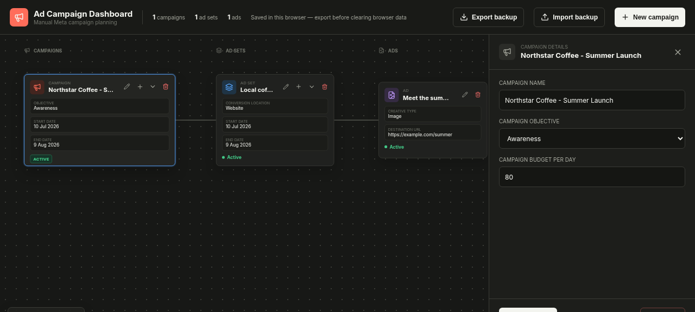

# Ad Campaign Dashboard

A visual, manual planning workspace for Meta ad campaigns. Try the public edition at **[c0derator.github.io/AdsManager](https://c0derator.github.io/AdsManager/)**.



## Features

- Plan campaigns, ad sets, and ads on a connected workflow canvas.
- Edit targeting, dates, destinations, budgets, and creative details.
- Upload small images or videos and keep them embedded with local campaign data.
- Undo campaign-data changes with <kbd>Ctrl</kbd>/<kbd>Cmd</kbd> + <kbd>Z</kbd> outside form fields.
- Export and import versioned JSON backups.

This is a planning tool. It does not connect to the Meta Marketing API, publish ads, or report live performance metrics.

## Privacy and storage

The GitHub Pages edition has no account or server. Campaigns and uploaded creatives stay in the current browser's local storage and are not shared between browser profiles or devices. Creative uploads are limited to 3 MB total per selection because browser storage is small.

Clearing site data removes the workspace. Export a backup before clearing browser data or moving to another browser. Importing a valid backup replaces the current workspace only after confirmation.

## Run locally

Requires Node.js 22 or newer.

```sh
npm ci
npm run dev
```

The local development server uses browser storage. To verify the public production build:

```sh
VITE_STORAGE_MODE=local npm run build -- --base=/AdsManager/
npx vite preview
```

## Tests

```sh
npm test
```

The tests cover authentication, cloud-storage migration, node formatting, and backup validation.

## Deployment modes

The Pages workflow tests and builds `main` with `VITE_STORAGE_MODE=local` and the `/AdsManager/` base path. The existing Vercel deployment omits that setting, so production continues to use its password-protected Neon and Vercel Blob storage.

## License

[MIT](LICENSE)
